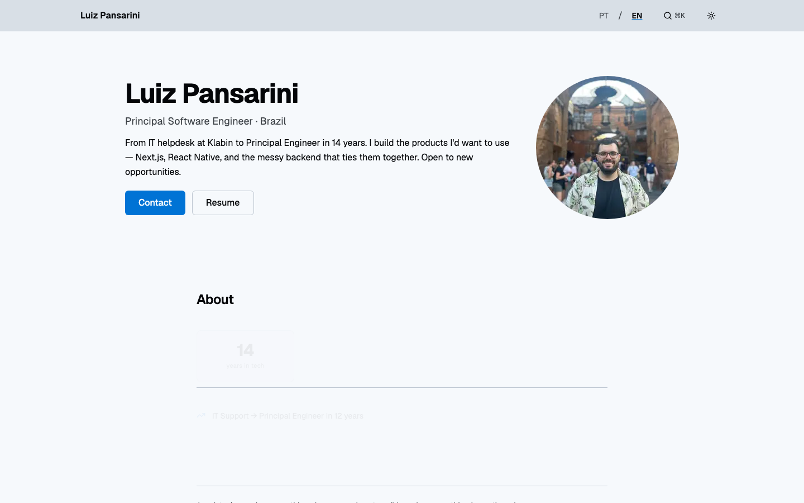
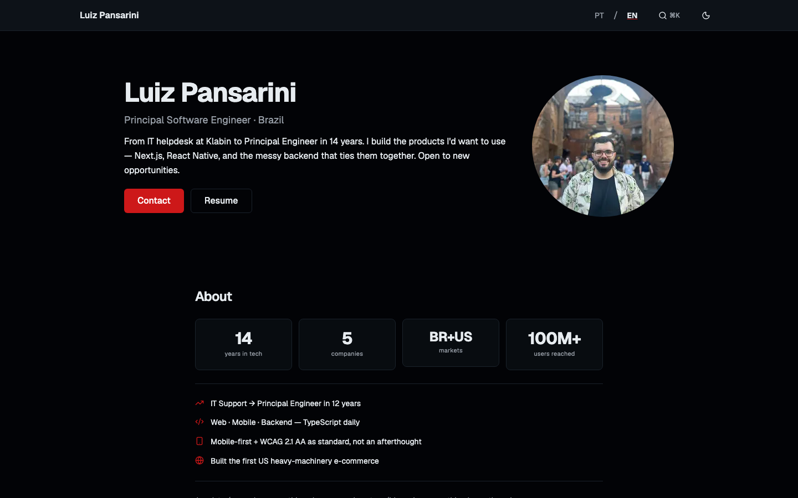

# pansarinitech

<!-- ci-validation -->

> [English](#english) · [Português](#português)

---

## English

Bilingual (PT/EN) personal portfolio for **Luiz Pansarini**, Principal Software Engineer. Designed to attract recruiters (BR + international), freelance clients, and the developer community.

The site features a **subtle Star Wars aesthetic** — light mode follows a Jedi palette (saber blue), dark mode follows a Sith palette (saber red) — with the theme toggle itself acting as the central themed element.

**Core goal:** communicate "Principal-level full-stack engineer" within 5 seconds on a recruiter's phone, with a clear path to contact.

| Jedi mode (light) | Sith mode (dark) |
|---|---|
|  |  |

### Features

- **Bilingual** — full PT/EN support via `next-intl`; locale auto-detected from browser `Accept-Language`
- **Jedi / Sith theme** — light/dark toggle with CSS-variable palette swap; no per-component code changes
- **Blog** — MDX-based posts in `content/blog/`, rendered via `next-mdx-remote/rsc` with build-time syntax highlighting (Shiki)
- **Projects showcase** — case studies in `content/projects/`, with per-locale MDX files
- **Career timeline** — chronological history from IT support to Principal Engineer
- **Skills section** — categorized tech stack display
- **Now page** — what Luiz is currently working on
- **Contact** — direct email + LinkedIn; no form backend required
- **OG images** — dynamic `next/og` images per route segment
- **Structured data** — JSON-LD for Person and Article schemas
- **Analytics** — `@vercel/analytics` + `@vercel/speed-insights` (cookieless, free on Hobby)

### Stack

| Layer | Technology |
|---|---|
| Framework | Next.js 16.2 (App Router, Turbopack) |
| UI | React 19 + Shadcn/UI |
| Language | TypeScript (strict) |
| Styling | Tailwind CSS v4 (CSS-first config, OKLCH palette) |
| i18n | next-intl 4.11 |
| Theming | next-themes 0.4 |
| Animation | motion 12 (formerly framer-motion) |
| MDX | next-mdx-remote 6 + rehype-pretty-code + shiki |
| Icons | lucide-react + @iconify/react |
| Fonts | Geist Sans/Mono + FT Aurebesh (decorative) |
| Hosting | Vercel |

### Getting Started

**Requirements:** Node.js ≥ 22, pnpm 10

```bash
# Install dependencies
pnpm install

# Start dev server (auto-redirects / → /en or /pt based on browser language)
pnpm dev          # http://localhost:3000

# Production build
pnpm build
pnpm start
```

### Project Structure

```
src/
  app/[locale]/         # Locale-segmented App Router routes
    blog/               # Blog listing + post pages
    projects/           # Project case studies
    now/                # Now page
  components/
    sections/           # Page sections (Hero, About, Skills, Career, etc.)
    blog/               # Blog-specific components (TOC, PostCard, etc.)
    mdx/                # MDX component overrides
    shared/             # Layout components (Header, Footer, ThemeToggle)
    ui/                 # Shadcn/UI primitives
  data/                 # Typed static data (career, skills, projects, etc.)
  lib/                  # Utilities, MDX loader, SEO helpers
  i18n/                 # next-intl routing + request config

content/
  blog/                 # MDX posts — one file per locale (*.en.mdx / *.pt.mdx)
  projects/             # MDX case studies — one file per locale

messages/
  en.json               # English translations
  pt.json               # Portuguese translations
```

### Quality Gates

```bash
# Lint + format (Biome)
pnpm lint
pnpm lint:fix

# TypeScript strict check
pnpm exec tsc --noEmit

# Unit tests (Vitest + React Testing Library)
pnpm test:unit
pnpm test:unit:coverage

# E2E + accessibility (Playwright + axe-core)
pnpm test:e2e          # Full E2E suite
pnpm test:a11y         # axe-core matrix: en/pt × light/dark × home/404
pnpm test:sith         # Sith-red contrast regression smoke
pnpm test:iphone-se    # Mobile layout on iPhone SE (375px)

# Content verification
pnpm verify:static     # All [locale] routes are SSG (●), no unexpected ƒ
pnpm verify:data       # Zod schema validation for typed data
pnpm verify:posts      # Frontmatter + locale parity for blog posts
pnpm verify:projects   # Frontmatter + locale parity for project MDX
pnpm verify:metadata   # OG + SEO metadata completeness
```

Every PR runs all gates via `.github/workflows/ci.yml`. Lighthouse runs on `main` only via `.github/workflows/lighthouse.yml` (target: Performance ≥ 95 on mobile).

### Accessibility

- WCAG 2.1 AA — non-negotiable
- axe-core score: 1.0 across all locale/theme/page combinations
- Respects `prefers-reduced-motion` and `prefers-color-scheme`
- Mobile-first: tested on iPhone SE (375px) up

### Author

Luiz Pansarini · Principal Software Engineer · [linkedin.com/in/luizpansarini](https://linkedin.com/in/luizpansarini) · [github.com/LuizHAP](https://github.com/LuizHAP)

### License

MIT

---

## Português

Portfólio pessoal bilíngue (PT/EN) de **Luiz Pansarini**, Principal Software Engineer. Criado para atrair recrutadores (BR + internacional), clientes freelance e a comunidade de desenvolvedores.

O site apresenta uma **estética sutil de Star Wars** — o modo claro segue uma paleta Jedi (azul de sabre de luz), o modo escuro uma paleta Sith (vermelho de sabre de luz) — com o botão de troca de tema como elemento central da identidade visual.

**Objetivo principal:** comunicar "engenheiro full-stack de nível Principal" em até 5 segundos no celular de um recrutador, com um caminho claro para contato.

| Modo Jedi (claro) | Modo Sith (escuro) |
|---|---|
|  |  |

### Funcionalidades

- **Bilíngue** — suporte completo PT/EN via `next-intl`; locale detectado automaticamente pelo `Accept-Language` do navegador
- **Tema Jedi / Sith** — alternância claro/escuro com troca de paleta por variáveis CSS; sem alterações por componente
- **Blog** — posts em MDX em `content/blog/`, renderizados via `next-mdx-remote/rsc` com syntax highlighting em tempo de build (Shiki)
- **Portfólio de projetos** — estudos de caso em `content/projects/`, com arquivos MDX por locale
- **Linha do tempo de carreira** — histórico cronológico desde suporte de TI até Principal Engineer
- **Seção de skills** — exibição categorizada do stack técnico
- **Página Now** — o que Luiz está trabalhando atualmente
- **Contato** — e-mail direto + LinkedIn; sem backend de formulário necessário
- **Imagens OG** — imagens dinâmicas via `next/og` por segmento de rota
- **Dados estruturados** — JSON-LD com schemas Person e Article
- **Analytics** — `@vercel/analytics` + `@vercel/speed-insights` (sem cookies, gratuito no Hobby)

### Stack

| Camada | Tecnologia |
|---|---|
| Framework | Next.js 16.2 (App Router, Turbopack) |
| UI | React 19 + Shadcn/UI |
| Linguagem | TypeScript (strict) |
| Estilização | Tailwind CSS v4 (config CSS-first, paleta OKLCH) |
| i18n | next-intl 4.11 |
| Temas | next-themes 0.4 |
| Animação | motion 12 (antigo framer-motion) |
| MDX | next-mdx-remote 6 + rehype-pretty-code + shiki |
| Ícones | lucide-react + @iconify/react |
| Fontes | Geist Sans/Mono + FT Aurebesh (decorativa) |
| Hospedagem | Vercel |

### Começando

**Requisitos:** Node.js ≥ 22, pnpm 10

```bash
# Instalar dependências
pnpm install

# Iniciar servidor de desenvolvimento (redireciona / → /en ou /pt conforme o idioma do navegador)
pnpm dev          # http://localhost:3000

# Build de produção
pnpm build
pnpm start
```

### Estrutura do Projeto

```
src/
  app/[locale]/         # Rotas do App Router segmentadas por locale
    blog/               # Listagem e páginas de posts do blog
    projects/           # Estudos de caso de projetos
    now/                # Página Now
  components/
    sections/           # Seções de página (Hero, About, Skills, Career, etc.)
    blog/               # Componentes específicos do blog (TOC, PostCard, etc.)
    mdx/                # Overrides de componentes MDX
    shared/             # Componentes de layout (Header, Footer, ThemeToggle)
    ui/                 # Primitivos do Shadcn/UI
  data/                 # Dados estáticos tipados (carreira, skills, projetos, etc.)
  lib/                  # Utilitários, loader MDX, helpers de SEO
  i18n/                 # Configuração de roteamento + request do next-intl

content/
  blog/                 # Posts MDX — um arquivo por locale (*.en.mdx / *.pt.mdx)
  projects/             # Estudos de caso MDX — um arquivo por locale

messages/
  en.json               # Traduções em inglês
  pt.json               # Traduções em português
```

### Quality Gates

```bash
# Lint + formatação (Biome)
pnpm lint
pnpm lint:fix

# Verificação TypeScript strict
pnpm exec tsc --noEmit

# Testes unitários (Vitest + React Testing Library)
pnpm test:unit
pnpm test:unit:coverage

# E2E + acessibilidade (Playwright + axe-core)
pnpm test:e2e          # Suite completa de E2E
pnpm test:a11y         # Matriz axe-core: en/pt × claro/escuro × home/404
pnpm test:sith         # Smoke test de contraste do tema Sith
pnpm test:iphone-se    # Layout mobile no iPhone SE (375px)

# Verificação de conteúdo
pnpm verify:static     # Todas as rotas [locale] são SSG (●), sem ƒ inesperado
pnpm verify:data       # Validação de schemas Zod para dados tipados
pnpm verify:posts      # Frontmatter + paridade de locale nos posts do blog
pnpm verify:projects   # Frontmatter + paridade de locale nos MDX de projetos
pnpm verify:metadata   # Completude de metadados OG + SEO
```

Todos os gates rodam em cada PR via `.github/workflows/ci.yml`. O Lighthouse roda apenas na `main` via `.github/workflows/lighthouse.yml` (meta: Performance ≥ 95 no mobile).

### Acessibilidade

- WCAG 2.1 AA — inegociável
- Score axe-core: 1.0 em todas as combinações de locale/tema/página
- Respeita `prefers-reduced-motion` e `prefers-color-scheme`
- Mobile-first: testado a partir do iPhone SE (375px)

### Autor

Luiz Pansarini · Principal Software Engineer · [linkedin.com/in/luizpansarini](https://linkedin.com/in/luizpansarini) · [github.com/LuizHAP](https://github.com/LuizHAP)

### Licença

MIT
