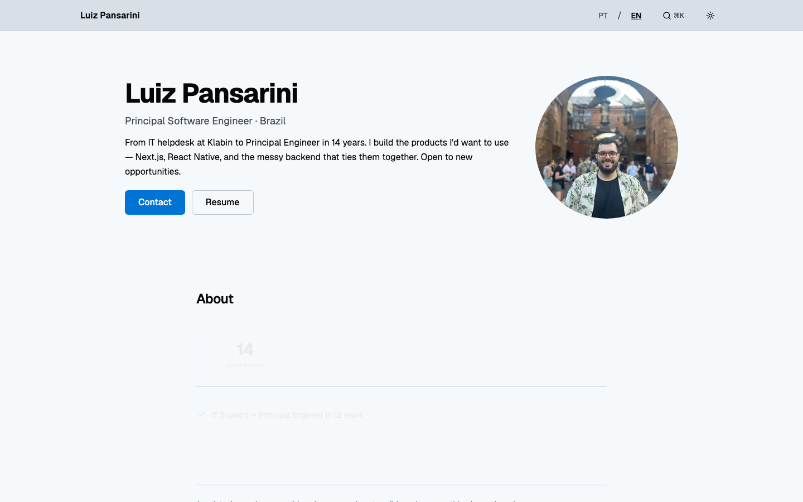
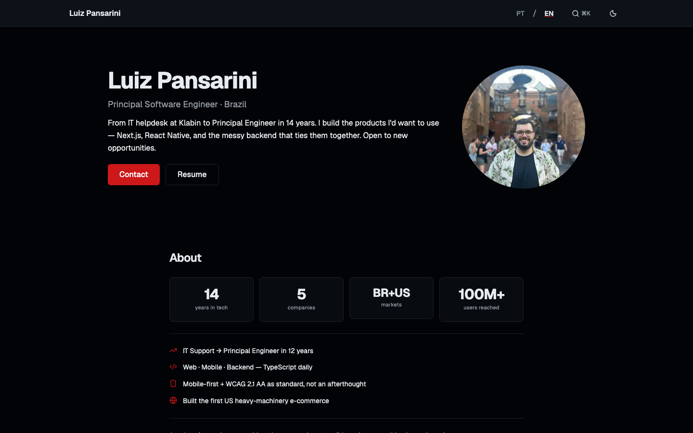

# pansarinitech

<!-- ci-validation -->

> [English](#english) · [Português](#português)

---

## English

Bilingual (PT/EN) personal portfolio for **Luiz Pansarini**, Principal Software Engineer. Designed to attract recruiters (BR + international), freelance clients, and the developer community.

The site features a **subtle Star Wars aesthetic** — light mode follows a Jedi palette (saber blue), dark mode follows a Sith palette (saber red) — with the theme toggle itself acting as the central themed element.

**Core goal:** communicate "Principal-level full-stack engineer" within 5 seconds on a recruiter's phone, with a clear path to contact.

| Jedi mode (light) | Sith mode (dark) |
|---|---|
|  |  |

### Features

- **Bilingual** — full PT/EN support via `next-intl`; locale auto-detected from browser `Accept-Language`
- **Jedi / Sith theme** — light/dark toggle with CSS-variable palette swap; no per-component code changes
- **Blog** — MDX-based posts in `content/blog/`, rendered via `next-mdx-remote/rsc` with build-time syntax highlighting (Shiki)
- **Projects showcase** — case studies in `content/projects/`, with per-locale MDX files
- **Career timeline** — chronological history from IT support to Principal Engineer
- **Skills section** — categorized tech stack display
- **Now page** — what Luiz is currently working on
- **Contact** — direct email + LinkedIn; no form backend required
- **OG images** — dynamic `next/og` images per route segment
- **Structured data** — JSON-LD for Person and Article schemas
- **Analytics** — `@vercel/analytics` + `@vercel/speed-insights` (cookieless, free on Hobby)

### Stack

| Layer | Technology |
|---|---|
| Framework | Next.js 16.2 (App Router, Turbopack) |
| UI | React 19 + Shadcn/UI |
| Language | TypeScript (strict) |
| Styling | Tailwind CSS v4 (CSS-first config, OKLCH palette) |
| i18n | next-intl 4.11 |
| Theming | next-themes 0.4 |
| Animation | motion 12 (formerly framer-motion) |
| MDX | next-mdx-remote 6 + rehype-pretty-code + shiki |
| Icons | lucide-react + @iconify/react |
| Fonts | Geist Sans/Mono + FT Aurebesh (decorative) |
| Hosting | Vercel |

### Getting Started

**Requirements:** Node.js ≥ 22, pnpm 10

```bash
# Install dependencies
pnpm install

# Start dev server (auto-redirects / → /en or /pt based on browser language)
pnpm dev          # http://localhost:3000

# Production build
pnpm build
pnpm start
```

### Project Structure

```
src/
  app/[locale]/         # Locale-segmented App Router routes
    blog/               # Blog listing + post pages
    projects/           # Project case studies
    now/                # Now page
  components/
    sections/           # Page sections (Hero, About, Skills, Career, etc.)
    blog/               # Blog-specific components (TOC, PostCard, etc.)
    mdx/                # MDX component overrides
    shared/             # Layout components (Header, Footer, ThemeToggle)
    ui/                 # Shadcn/UI primitives
  data/                 # Typed static data (career, skills, projects, etc.)
  lib/                  # Utilities, MDX loader, SEO helpers
  i18n/                 # next-intl routing + request config

content/
  blog/                 # MDX posts — one file per locale (*.en.mdx / *.pt.mdx)
  projects/             # MDX case studies — one file per locale

messages/
  en.json               # English translations
  pt.json               # Portuguese translations
```

### Quality Gates

```bash
# Lint + format (Biome)
pnpm lint
pnpm lint:fix

# TypeScript strict check
pnpm exec tsc --noEmit

# Unit tests (Vitest + React Testing Library)
pnpm test:unit
pnpm test:unit:coverage

# E2E + accessibility (Playwright + axe-core)
pnpm test:e2e          # Full E2E suite
pnpm test:a11y         # axe-core matrix: en/pt × light/dark × home/404
pnpm test:sith         # Sith-red contrast regression smoke
pnpm test:iphone-se    # Mobile layout on iPhone SE (375px)

# Content verification
pnpm verify:static     # All [locale] routes are SSG (●), no unexpected ƒ
pnpm verify:data       # Zod schema validation for typed data
pnpm verify:posts      # Frontmatter + locale parity for blog posts
pnpm verify:projects   # Frontmatter + locale parity for project MDX
pnpm verify:metadata   # OG + SEO metadata completeness
```

Every PR runs all gates via `.github/workflows/ci.yml`. Lighthouse runs on `main` only via `.github/workflows/lighthouse.yml` (target: Performance ≥ 95 on mobile).

### Client previews

Share a client's site on a link you control, under a bar with your brand and a Desktop/Mobile toggle.

#### From the repo

1. Copy the client's files into `public/client-previews/<slug>/` with `index.html` at the root. Keep every asset path relative (`style.css`, `img/logo.png`), never starting with `/`.
2. Add `{ slug, client, locale }` to `src/data/client-previews.ts`. `locale` is `pt` or `en` and picks the bar language.
3. Run `pnpm test:unit`, which checks the slug format, uniqueness and that `index.html` exists.
4. Share `https://pansarini.dev/preview/<slug>`.

#### From Vercel Blob (no commit or deploy)

One-time setup:

1. In the Vercel dashboard, go to Storage, Create, Blob and pick Private access. Use this store only for previews, because every file in it can be reached under `/client-previews/`.
2. Connect the store to the project. To use it in local dev, run `vercel env pull .env.local`.

Per preview:

1. In the store's file browser, create a folder `<slug>` and upload `index.html` plus its assets with the same relative paths (`<slug>/style.css`, `<slug>/img/logo.png`).
2. Share `https://pansarini.dev/preview/<slug>`.

The bar takes the client name from `<title>` (the text before the first `|`, `–`, `—` or `-` with a space on each side) and the language from `<html lang>` (`pt…` gives Portuguese, any other value gives English, and a missing lang gives Portuguese). New uploads and changes can take about 5 minutes to show, or show right away after "Atualizar índice" in the admin. A slug in `src/data/client-previews.ts` wins over a Blob folder with the same name.

Notes:

- Slugs use only `[a-z0-9-]`, in the repo and for Blob folders alike.
- Previews from both sources are sent with `X-Robots-Tag: noindex` and a robots meta tag so search engines skip them, but anyone with the link can open them. Use a hard-to-guess slug (e.g. `acme-7f3k2q`) for anything not public yet.
- The frame is sandboxed without same-origin access: client scripts run but cannot read the portfolio's cookies or storage, so client code that needs localStorage or cookies will not work in the frame.
- Opening the raw `/client-previews/<slug>/index.html` URL bypasses the sandbox, so only paste or upload code you trust.

### Admin

A hidden page to list every preview, check its files and warnings, and copy the public URLs. It is not linked anywhere, it is sent with `noindex`, and it returns 404 unless both environment variables below exist.

Setup:

1. In Vercel, go to Project Settings, Environment Variables, and add `ADMIN_USER` and `ADMIN_PASSWORD` for Production, both marked Sensitive (or run `vercel env add ADMIN_USER production` and `vercel env add ADMIN_PASSWORD production`). Use a long random password, e.g. `openssl rand -base64 24`.
2. Redeploy so the new values take effect.
3. Locally, put both in `.env.local`.

Sessions last 8 hours. Changing the password logs out every session.

URLs:

- `https://pansarini.dev/admin` lists every preview (login at `/admin/login`).
- `https://pansarini.dev/admin/<slug>` shows one preview: its files, warnings and a sandboxed frame.
- `https://pansarini.dev/admin/leads` is the leads board, linked from the admin header.

Cache:

- The Blob listing is cached for 5 minutes and shared by the admin and the public pages, so a new upload shows up within about 5 minutes, or right away after "Atualizar índice".
- Blob files are cached on Vercel's CDN for 5 minutes. "Limpar cache deste site" marks them stale, so the next load may still serve the old version once while it refreshes.

Taking a preview offline:

- On a Blob preview's admin page, "Desativar prévia" takes it offline without deleting its files. It writes a marker blob `<slug>/.disabled` to the store, refreshes the index and deletes the site's files from Vercel's CDN, so `/preview/<slug>` and everything under `/client-previews/<slug>/` return 404 right away. The admin keeps listing it with a "Desativada" badge, and "Copiar todas as URLs" leaves it out.
- "Reativar prévia" deletes the marker and brings the preview back.
- The marker also works when created by hand. Upload a small file with any content (it cannot be empty) as `<slug>/.disabled` in the store's file browser, or run `vercel blob put <file> --access private --pathname <slug>/.disabled`. Then click "Atualizar índice" (otherwise it takes up to 5 minutes) and run `vercel cache dangerously-delete --tag client-preview:<slug>` so copies of its files already in the CDN stop being served. To bring it back, delete the marker by hand and click "Atualizar índice".
- To remove a preview for good, click "Desativar prévia" first (that clears the CDN), then delete its folder in the store and click "Atualizar índice".
- None of this applies to previews from the repo. Take those down by removing the entry from `src/data/client-previews.ts` and the folder from `public/client-previews/` in a commit.

Leads:

- Each lead is one JSON record in Upstash Redis (Vercel Marketplace) at `leads:lead:<id>`, listed by the sorted set `leads:index`. The board reads `KV_REST_API_URL` and `KV_REST_API_TOKEN`, which the integration adds to every environment, and locally `.env.local`. Without them the board shows "Redis indisponível".
- The stages are Prospectado, Prévia pronta, Contatado, Em conversa, Proposta and Fechado, in that order, with Perdido collapsed at the end. The stage menu and "Mover" on a card change the stage, and every change is recorded with its time in the lead's history.
- A lead can link a Blob preview, and the card shows whether it is active or disabled. A next step whose date has passed (São Paulo time) marks the card "Atrasado".
- "Excluir lead", then "Confirmar exclusão", deletes the record and its history for good.

Warnings flag a folder name outside `[a-z0-9-]`, a missing `index.html`, a missing `<title>`, asset paths starting with `/`, a repo preview with the same slug, and a slug that matches an admin page (`leads`, `login`), whose admin link opens that page instead.

### Accessibility

- WCAG 2.1 AA — non-negotiable
- axe-core score: 1.0 across all locale/theme/page combinations
- Respects `prefers-reduced-motion` and `prefers-color-scheme`
- Mobile-first: tested on iPhone SE (375px) up

### Author

Luiz Pansarini · Principal Software Engineer · [linkedin.com/in/luizpansarini](https://linkedin.com/in/luizpansarini) · [github.com/LuizHAP](https://github.com/LuizHAP)

### License

MIT

---

## Português

Portfólio pessoal bilíngue (PT/EN) de **Luiz Pansarini**, Principal Software Engineer. Criado para atrair recrutadores (BR + internacional), clientes freelance e a comunidade de desenvolvedores.

O site apresenta uma **estética sutil de Star Wars** — o modo claro segue uma paleta Jedi (azul de sabre de luz), o modo escuro uma paleta Sith (vermelho de sabre de luz) — com o botão de troca de tema como elemento central da identidade visual.

**Objetivo principal:** comunicar "engenheiro full-stack de nível Principal" em até 5 segundos no celular de um recrutador, com um caminho claro para contato.

| Modo Jedi (claro) | Modo Sith (escuro) |
|---|---|
|  |  |

### Funcionalidades

- **Bilíngue** — suporte completo PT/EN via `next-intl`; locale detectado automaticamente pelo `Accept-Language` do navegador
- **Tema Jedi / Sith** — alternância claro/escuro com troca de paleta por variáveis CSS; sem alterações por componente
- **Blog** — posts em MDX em `content/blog/`, renderizados via `next-mdx-remote/rsc` com syntax highlighting em tempo de build (Shiki)
- **Portfólio de projetos** — estudos de caso em `content/projects/`, com arquivos MDX por locale
- **Linha do tempo de carreira** — histórico cronológico desde suporte de TI até Principal Engineer
- **Seção de skills** — exibição categorizada do stack técnico
- **Página Now** — o que Luiz está trabalhando atualmente
- **Contato** — e-mail direto + LinkedIn; sem backend de formulário necessário
- **Imagens OG** — imagens dinâmicas via `next/og` por segmento de rota
- **Dados estruturados** — JSON-LD com schemas Person e Article
- **Analytics** — `@vercel/analytics` + `@vercel/speed-insights` (sem cookies, gratuito no Hobby)

### Stack

| Camada | Tecnologia |
|---|---|
| Framework | Next.js 16.2 (App Router, Turbopack) |
| UI | React 19 + Shadcn/UI |
| Linguagem | TypeScript (strict) |
| Estilização | Tailwind CSS v4 (config CSS-first, paleta OKLCH) |
| i18n | next-intl 4.11 |
| Temas | next-themes 0.4 |
| Animação | motion 12 (antigo framer-motion) |
| MDX | next-mdx-remote 6 + rehype-pretty-code + shiki |
| Ícones | lucide-react + @iconify/react |
| Fontes | Geist Sans/Mono + FT Aurebesh (decorativa) |
| Hospedagem | Vercel |

### Começando

**Requisitos:** Node.js ≥ 22, pnpm 10

```bash
# Instalar dependências
pnpm install

# Iniciar servidor de desenvolvimento (redireciona / → /en ou /pt conforme o idioma do navegador)
pnpm dev          # http://localhost:3000

# Build de produção
pnpm build
pnpm start
```

### Estrutura do Projeto

```
src/
  app/[locale]/         # Rotas do App Router segmentadas por locale
    blog/               # Listagem e páginas de posts do blog
    projects/           # Estudos de caso de projetos
    now/                # Página Now
  components/
    sections/           # Seções de página (Hero, About, Skills, Career, etc.)
    blog/               # Componentes específicos do blog (TOC, PostCard, etc.)
    mdx/                # Overrides de componentes MDX
    shared/             # Componentes de layout (Header, Footer, ThemeToggle)
    ui/                 # Primitivos do Shadcn/UI
  data/                 # Dados estáticos tipados (carreira, skills, projetos, etc.)
  lib/                  # Utilitários, loader MDX, helpers de SEO
  i18n/                 # Configuração de roteamento + request do next-intl

content/
  blog/                 # Posts MDX — um arquivo por locale (*.en.mdx / *.pt.mdx)
  projects/             # Estudos de caso MDX — um arquivo por locale

messages/
  en.json               # Traduções em inglês
  pt.json               # Traduções em português
```

### Quality Gates

```bash
# Lint + formatação (Biome)
pnpm lint
pnpm lint:fix

# Verificação TypeScript strict
pnpm exec tsc --noEmit

# Testes unitários (Vitest + React Testing Library)
pnpm test:unit
pnpm test:unit:coverage

# E2E + acessibilidade (Playwright + axe-core)
pnpm test:e2e          # Suite completa de E2E
pnpm test:a11y         # Matriz axe-core: en/pt × claro/escuro × home/404
pnpm test:sith         # Smoke test de contraste do tema Sith
pnpm test:iphone-se    # Layout mobile no iPhone SE (375px)

# Verificação de conteúdo
pnpm verify:static     # Todas as rotas [locale] são SSG (●), sem ƒ inesperado
pnpm verify:data       # Validação de schemas Zod para dados tipados
pnpm verify:posts      # Frontmatter + paridade de locale nos posts do blog
pnpm verify:projects   # Frontmatter + paridade de locale nos MDX de projetos
pnpm verify:metadata   # Completude de metadados OG + SEO
```

Todos os gates rodam em cada PR via `.github/workflows/ci.yml`. O Lighthouse roda apenas na `main` via `.github/workflows/lighthouse.yml` (meta: Performance ≥ 95 no mobile).

### Prévias de clientes

Compartilhe o site de um cliente em um link que você controla, sob uma barra com a sua marca e um seletor Desktop/Celular.

#### Pelo repositório

1. Copie os arquivos do cliente para `public/client-previews/<slug>/`, com o `index.html` na raiz. Mantenha todos os caminhos de assets relativos (`style.css`, `img/logo.png`), nunca começando com `/`.
2. Adicione `{ slug, client, locale }` em `src/data/client-previews.ts`. `locale` é `pt` ou `en` e define o idioma da barra.
3. Rode `pnpm test:unit`, que verifica o formato do slug, se ele é único e se o `index.html` existe.
4. Compartilhe `https://pansarini.dev/preview/<slug>`.

#### Pelo Vercel Blob (sem commit nem deploy)

Configuração única:

1. No painel da Vercel, vá em Storage, Create, Blob e escolha o acesso Private. Use esse store só para prévias, porque qualquer arquivo nele pode ser acessado em `/client-previews/`.
2. Conecte o store ao projeto. Para usá-lo no desenvolvimento local, rode `vercel env pull .env.local`.

A cada prévia:

1. No navegador de arquivos do store, crie uma pasta `<slug>` e envie o `index.html` com os assets, mantendo os mesmos caminhos relativos (`<slug>/style.css`, `<slug>/img/logo.png`).
2. Compartilhe `https://pansarini.dev/preview/<slug>`.

A barra pega o nome do cliente do `<title>` (o texto antes do primeiro `|`, `–`, `—` ou `-` com espaço dos dois lados) e o idioma do `<html lang>` (`pt…` vira português, qualquer outro valor vira inglês, e sem lang fica português). Envios novos e alterações podem levar cerca de 5 minutos para aparecer, ou aparecem na hora com "Atualizar índice" no admin. Um slug em `src/data/client-previews.ts` tem prioridade sobre uma pasta do Blob com o mesmo nome.

Observações:

- Slugs usam apenas `[a-z0-9-]`, tanto no repositório quanto nas pastas do Blob.
- As prévias das duas origens são enviadas com `X-Robots-Tag: noindex` e uma meta tag robots para que os buscadores as ignorem, mas qualquer pessoa com o link consegue abri-las. Use um slug difícil de adivinhar (ex.: `acme-7f3k2q`) para o que ainda não for público.
- O frame roda em sandbox sem acesso à mesma origem: os scripts do cliente rodam, mas não conseguem ler os cookies nem o armazenamento do portfólio, então código do cliente que dependa de localStorage ou cookies não funciona dentro do frame.
- Abrir a URL direta `/client-previews/<slug>/index.html` ignora o sandbox, então só cole ou envie código em que você confia.

### Admin

Uma página escondida para listar todas as prévias, analisar os arquivos e avisos de cada uma e copiar as URLs públicas. Ela não tem link em lugar nenhum, é enviada com `noindex` e responde 404 a menos que as duas variáveis de ambiente abaixo existam.

Configuração:

1. Na Vercel, vá em Project Settings, Environment Variables e adicione `ADMIN_USER` e `ADMIN_PASSWORD` para Production, as duas marcadas como Sensitive (ou rode `vercel env add ADMIN_USER production` e `vercel env add ADMIN_PASSWORD production`). Use uma senha longa e aleatória, ex.: `openssl rand -base64 24`.
2. Faça um redeploy para os valores novos valerem.
3. No ambiente local, coloque as duas no `.env.local`.

A sessão dura 8 horas. Trocar a senha desloga todas as sessões.

URLs:

- `https://pansarini.dev/admin` lista todas as prévias (login em `/admin/login`).
- `https://pansarini.dev/admin/<slug>` mostra uma prévia: arquivos, avisos e um frame em sandbox.
- `https://pansarini.dev/admin/leads` é o quadro de leads, com link no cabeçalho do admin.

Cache:

- A listagem do Blob fica em cache por 5 minutos e é compartilhada pelo admin e pelas páginas públicas, então um envio novo aparece em cerca de 5 minutos, ou na hora com "Atualizar índice".
- Os arquivos do Blob ficam em cache na CDN da Vercel por 5 minutos. "Limpar cache deste site" marca esse cache como desatualizado, então o próximo acesso ainda pode mostrar a versão antiga uma vez enquanto ele atualiza.

Tirar uma prévia do ar:

- Na página de uma prévia do Blob no admin, "Desativar prévia" tira a prévia do ar sem apagar os arquivos. Ela grava um blob marcador `<slug>/.disabled` no store, atualiza o índice e apaga os arquivos do site da CDN da Vercel, então `/preview/<slug>` e tudo em `/client-previews/<slug>/` passam a responder 404 na hora. O admin continua listando a prévia com o selo "Desativada", e ela fica de fora de "Copiar todas as URLs".
- "Reativar prévia" apaga o marcador e traz a prévia de volta.
- O marcador também funciona quando criado à mão. Envie um arquivo pequeno com qualquer conteúdo (ele não pode estar vazio) como `<slug>/.disabled` no navegador de arquivos do store, ou rode `vercel blob put <arquivo> --access private --pathname <slug>/.disabled`. Depois clique em "Atualizar índice" (senão leva até 5 minutos) e rode `vercel cache dangerously-delete --tag client-preview:<slug>` para que as cópias dos arquivos que já estão na CDN deixem de ser servidas. Para trazer a prévia de volta, apague o marcador à mão e clique em "Atualizar índice".
- Para remover uma prévia de vez, clique primeiro em "Desativar prévia" (isso limpa a CDN), depois apague a pasta dela no store e clique em "Atualizar índice".
- Nada disso vale para as prévias do repositório. Para tirá-las do ar, remova a entrada de `src/data/client-previews.ts` e a pasta de `public/client-previews/` em um commit.

Leads:

- Cada lead é um registro JSON no Upstash Redis (Vercel Marketplace) em `leads:lead:<id>`, listado pelo sorted set `leads:index`. O quadro lê `KV_REST_API_URL` e `KV_REST_API_TOKEN`, que a integração adiciona em todos os ambientes, e no ambiente local o `.env.local`. Sem elas, o quadro mostra "Redis indisponível".
- As etapas são Prospectado, Prévia pronta, Contatado, Em conversa, Proposta e Fechado, nessa ordem, com Perdido recolhido no fim. O menu de etapa e o "Mover" de cada card mudam a etapa, e cada mudança fica registrada com o horário no histórico do lead.
- Um lead pode ter uma prévia do Blob vinculada, e o card mostra se ela está ativa ou desativada. Um próximo passo com a data vencida (horário de São Paulo) marca o card como "Atrasado".
- "Excluir lead" e depois "Confirmar exclusão" apagam o registro e o histórico de vez.

Os avisos apontam nome de pasta fora de `[a-z0-9-]`, falta de `index.html`, falta de `<title>`, caminhos de assets começando com `/`, uma prévia do repositório com o mesmo slug e um slug igual ao de uma página do admin (`leads`, `login`), cujo link no admin abre essa página no lugar da prévia.

### Acessibilidade

- WCAG 2.1 AA — inegociável
- Score axe-core: 1.0 em todas as combinações de locale/tema/página
- Respeita `prefers-reduced-motion` e `prefers-color-scheme`
- Mobile-first: testado a partir do iPhone SE (375px)

### Autor

Luiz Pansarini · Principal Software Engineer · [linkedin.com/in/luizpansarini](https://linkedin.com/in/luizpansarini) · [github.com/LuizHAP](https://github.com/LuizHAP)

### Licença

MIT
